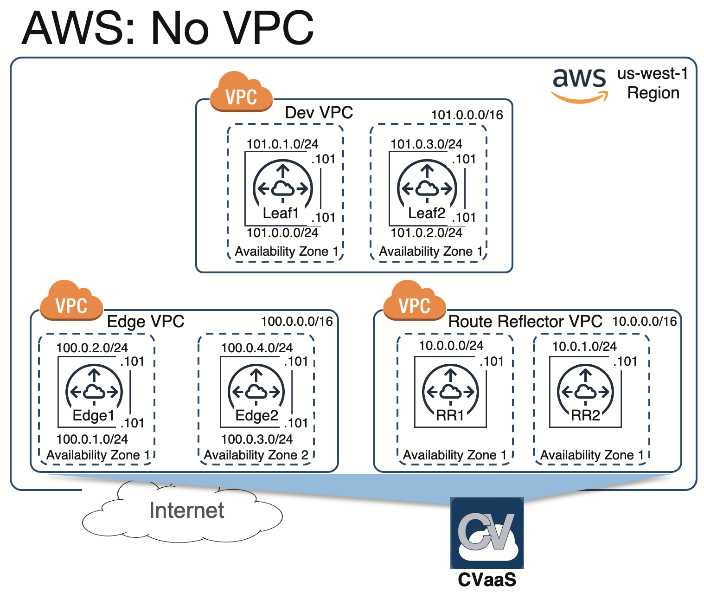

*Please read the main [README](../../README.md) to go over the steps to setup your environment and deploy this example topology.*

# Topology Overview

This topology uses Cloudeos modules that allow users to deploy CloudEOS routers in pre-created VPCs and subnets.
This example topology creates a single Edge VPC and a Leaf VPC which is connected using VPC Peering. Both Edge and Leaf
VPCs have been created before hand, the "aristavpc" and "aristasubnet" would only create the CloudEOS resources.

