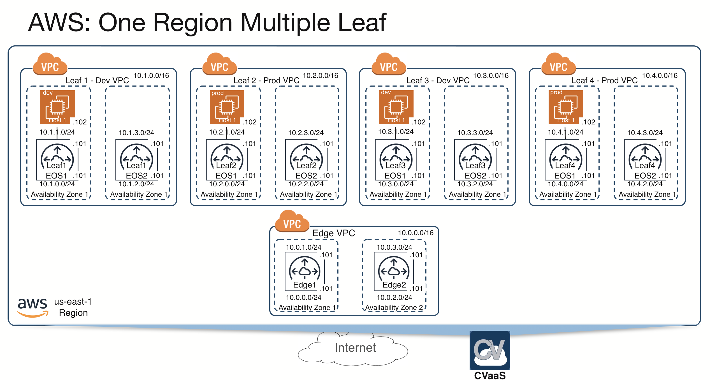

*Please read the main [README](../../README.md) to go over the steps to setup your environment and deploy this example topology.*

# Topology overview

This topology has an Edge VPC with multiple Leaf VPCs(4) connected to it in the same region. Every VPC has 2 CloudEOS instances each. And the Leaf VPCs have hosts behind it with iperf3 installed.

NOTE:
The figure for this topology is a little outdated.
To test High Availability(HA) in an intra availability zone(AZ) setup, the Leaf1 VPC deploys Leaf1EOS1 and Leaf2EOS2 routers in
same availability zone, with Leaf1EOS1 Intfs 0 and 1 and Leaf2EOS2 Intfs 0 and 1 belonging to same subnet respectively.
To test HA in an inter AZ setup, the Leaf2 VPC deploys Leaf2EOS2 and Leaf2EOS2 routers in different AZ and subnets.
Leaf3 and Leaf4 VPC don't configure HA and deploy the routers in different AZ and subnets.

