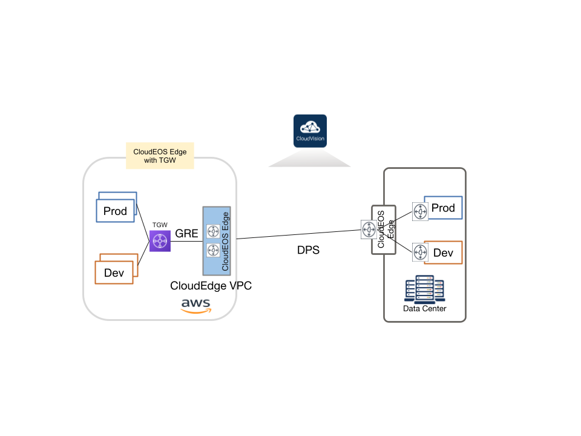

*Please read the main [README](../../README.md) to go over the steps to setup your environment and deploy this example topology.*

# Topology Overview

This topology uses Cloudeos modules that allow users to deploy an AWS transit gateway, two host routers in two different vpcs attached to it using transit gateway vpc attachments. There is a CloudEOS Edge vpc with a router in this region as well. The user may use a separate Go script provided by Arista to attach this Edge vpc to the transit gateway using transit gateway connect attachment.
In another region, there is a CloudEOS Edge vpc with a RouteReflector and an Edge router and two CloudEOS Leaf vpcs each with a Leaf router. These leaf routers each have a host behind them with iperf3 installed.
The two Edge routers are connected to each other and the RouteReflector as well.

