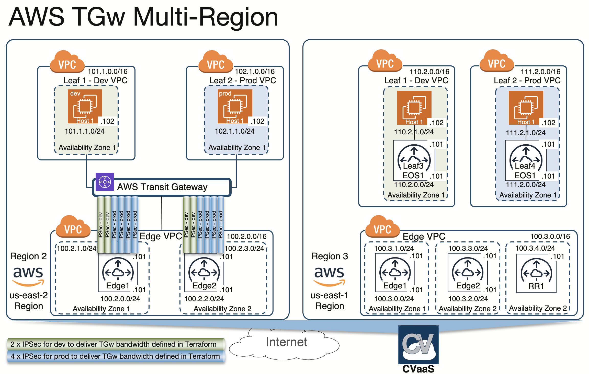

*Please read the main [README](../../README.md) to go over the steps to setup your environment and deploy this example topology.*

# Topology Overview
This topology is a AWS multi-region deployment.
Region 2 uses a Transit Gateway to connect Leaf VPCs to CloudEOS Routers deployed in a CloudEdge VPC. The Leaf VPCs are connected to prod and dev Route Tables in the Transit Gateway, and the Transit Gateway creates Ipsec VPN connections with the CloudEOS routers in the CloudEdge VPC.
Region 3 has edge-leaf deployments in which Leaf VPCs with CloudEOS routers deployed in dev and prod cnps are connected to CloudEOS routers in Edge Vpc. Edge routers are connected a CloudEOS route reflector in the Edge VPC. Hosts VMs deployed in the leaf VPCs with iperf3 installed can be used to test end-end cnps connectivity.

