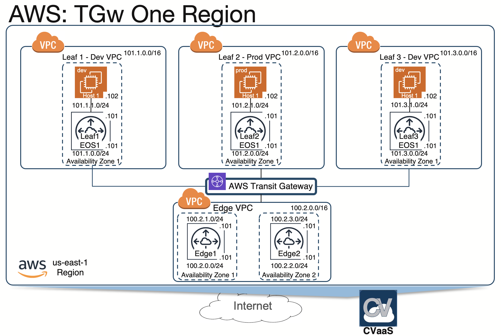

*Please read the main [README](../../README.md) to go over the steps to setup your environment and deploy this example topology.*

# Topology Overview
This topology uses a Transit Gateway to connect Leaf VPCs to CloudEOS Routers deployed in a CloudEdge VPC. The Leaf VPCs are connected to dprod and dev Route Tables in the Transit Gateway, and the Transit Gateway then creates an Ipsec VPN connection with the CloudEOS router in the CloudEdge VPC.

