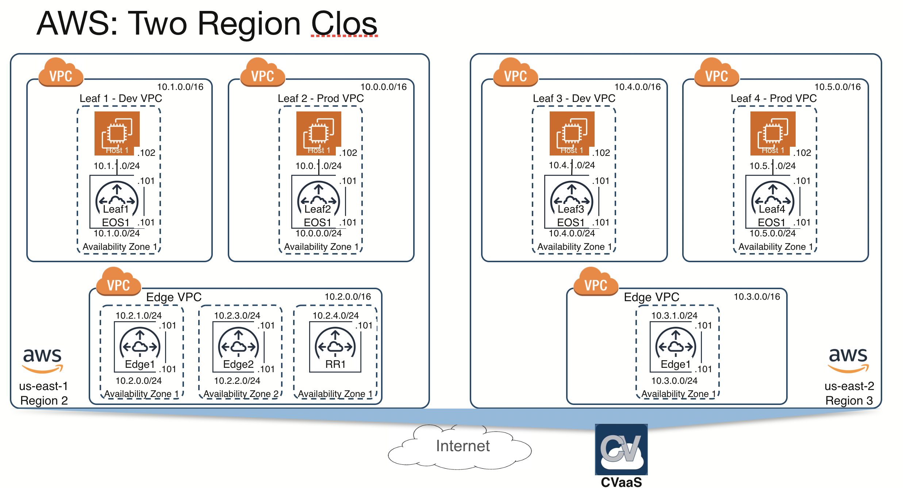

*Please read the main [README](../../README.md) to go over the steps to setup your environment and deploy this example topology.*

# Topology overview

This topology is a multi-region setup with 2 Edge VPCs in different regions (region 2 and 3) and leaf VPCs connected to those Edge VPCs. The edge routers are connected to a CloudEOS Route Reflector deployed in a VPC in region 1. 
Leaf VPCs also create host VMs with iperf3 installed. These hosts are connected to the Leaf CloudEOS instances and can be used to test end-end connectivity.

