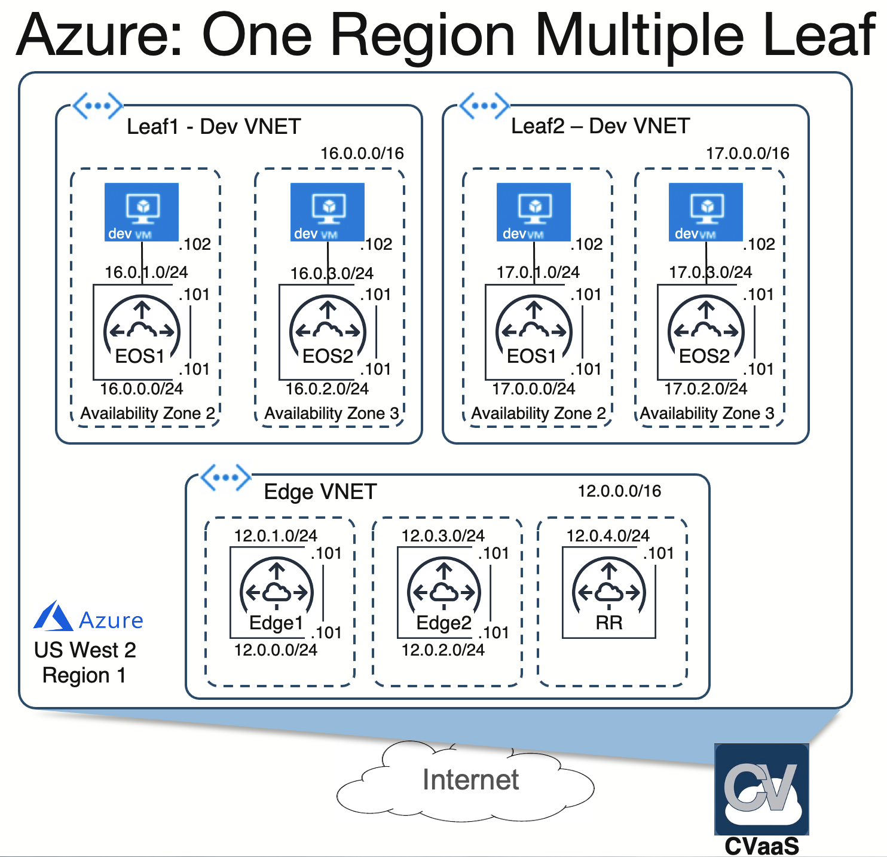

*Please read the main [README](../../README.md) to go over the steps to setup your environment and deploy this example topology.*

# Topology overview

This is an Azure topology, which has an Edge VNET/RG with 2 CloudEOS routers. There are 2 Leaf VNET's with CloudEOS routers in Dev VRFs(CNPS) with host VMs behind the CloudEOS Router.

