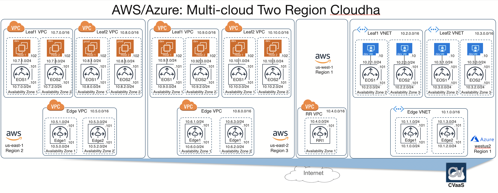

*Please read the main [README](../../README.md) to go over the steps to setup your environment and deploy this example topology.*

# Topology Overview

This topology creates a WAN fabric across multiple cloud prvoiders. We have 2 AWS regions, and 1 Azire region which constitutes of a Edge VPC with 2 CloudEOS routers, and Leaf VPCs with CloudEOS routers and hosts behind it.

